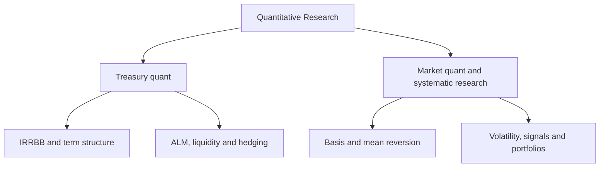

# Quantitative Research

This repository contains two related but distinct research lines: treasury quant for banking-book and balance-sheet problems, and market quant for systematic research on prices, volatility and trading signals.

The common method is to begin with the economic mechanism and information set, then build the model, test identification and stability, and keep the boundary between research evidence and a deployable strategy explicit.



## Treasury quant

The treasury line focuses on interest-rate risk, term-structure modelling and the behavioural assumptions that connect market curves to a bank balance sheet.

### Current work

#### [IRRBB Term-Structure Model Risk and Banking-Book Measurement Engine](./irrbb/)

The current project compares three-factor Nelson-Siegel with four-factor Svensson under a common curve-fitting and risk-measurement framework. It connects curve reconstruction and parameter stability to EVE, NII, repricing gaps, non-maturity deposit assumptions and regulatory shock scenarios.


### Research roadmap

- broader ALM and balance-sheet modelling;
- liquidity-risk measurement and stress scenarios;
- funds transfer pricing;
- deposit behaviour and NMD models;
- interest-rate hedging;
- bond portfolio duration, convexity and DV01;
- integrated treasury scenario engines.

## Market quant and systematic research

The market line focuses on causal signal construction, volatility, relative-value behaviour, backtesting and the difference between a statistical pattern and an executable trading process.

### Current work

#### [BTC Spot-Perpetual Basis: Single-Day Causal State-Space Research](./volatility/)

The current study uses one trading day by design. It builds availability-time bars, estimates a causal state-space model of the spot-perpetual basis, defines signal semantics explicitly, compares causal baselines and applies dependent-data inference. Execution costs and exchange-grade market access remain outside the current evidence boundary.


### Research roadmap

- ARCH and GARCH family models;
- realised-volatility measurement and forecasting;
- time-series momentum and mean reversion;
- systematic factor research and cross-sectional signals;
- market-regime detection;
- portfolio construction and risk budgeting;
- reusable backtesting infrastructure;
- execution-aware evaluation.

## Related work

The [US10Y and FOMC multimodal forecasting project](https://github.com/ugural87/portfolio_projects/tree/main/us10y_fomc_llm_forecasting) lives in the data-science portfolio because much of its contribution is a deep-learning and LLM fusion architecture. It also belongs on this research map because the target is a US Treasury yield and the evaluation is organised around FOMC events.

## Repository structure

```text
Quantitative_Research/
├── irrbb/
│   ├── README.md
│   └── 4F-Svensson_vs_3F-Nelson-Siegel_Opt/
├── volatility/
│   ├── README.md
│   └── btc-perp-HF_mean-reversion/
└── README.md
```

The physical folder names have been left unchanged to preserve existing links and history. As the repository grows, new projects will be grouped conceptually under treasury quant or market quant without presenting empty folders as completed work.

