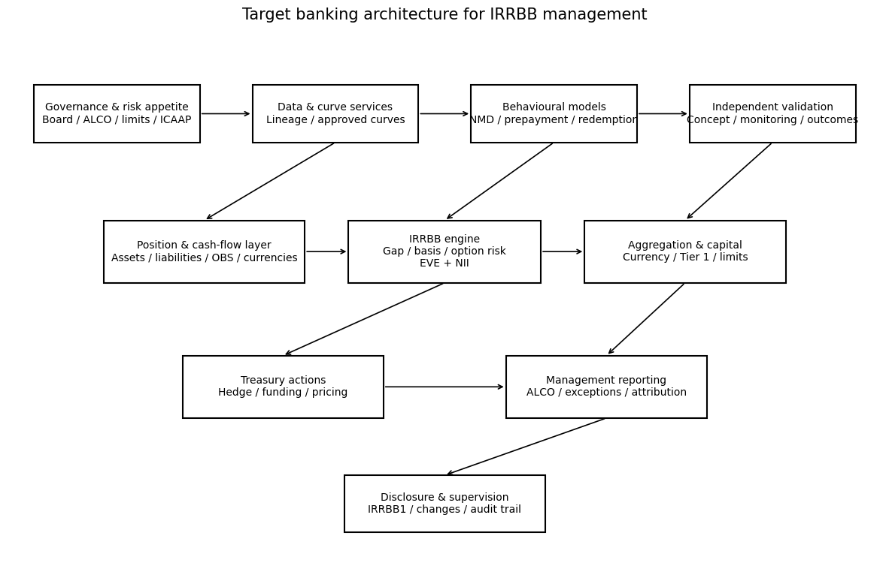

# IRRBB Term-Structure Model Risk and Banking-Book Measurement Engine

## Executive summary

This project is a portfolio-grade prototype for **Interest Rate Risk in the Banking Book (IRRBB)**. It compares two parametric term-structure representations inside the same controlled banking-book measurement architecture:

1. a **four-factor Nelson–Siegel–Svensson (NSS)** model, used as the more flexible curve-reconstruction challenger; and
2. a **three-factor Nelson–Siegel (NS)** model, used as the more parsimonious structural level–slope–curvature benchmark.

The project does not stop at curve fitting. Both models feed an identical downstream engine covering:

- temporal model development and out-of-sample validation;
- parameter-identification and PCA factor-alignment diagnostics;
- behavioural non-maturity deposit (NMD) segmentation;
- a synthetic but reconciled banking book;
- contractual and behavioural cash-flow generation;
- economic value of equity (EVE) measurement;
- prescribed IRRBB shock scenarios and Tier 1 normalisation;
- twelve-month constant-balance-sheet net interest income (NII) simulation;
- key-assumption sensitivity; and
- machine-readable model artifacts for independent comparison.

The central model-risk question is:

> **Does a better in-sample or out-of-sample curve fit justify a more complex model when its factors are poorly identified and the downstream EVE/NII decision impact is immaterial?**

The reference results show that the four-factor Svensson model reconstructs the observed curve slightly more accurately, while the three-factor Nelson–Siegel model provides materially stronger factor identification and economic interpretability. The difference between the two models' EVE and NII outputs is negligible relative to the sensitivity created by the behavioural NMD assumption. The recommended architecture therefore separates the purposes of **valuation**, **structural risk attribution**, **model challenge**, and **funds-transfer pricing** rather than forcing one parametric curve to perform all four roles.

> **Scope statement:** this is an auditable research and portfolio prototype, not a production regulatory engine, an approved internal measurement system, or a complete implementation of the Basel standardised framework.

---

## 1. Problem statement

Banks transform maturities and reprice assets and liabilities at different times. A change in the level or shape of interest-rate curves can therefore alter both:

- the present value of future banking-book cash flows; and
- the interest income and expense recognised over the planning horizon.

This creates three fundamental IRRBB sources:

- **Gap risk:** assets and liabilities mature or reprice at different dates.
- **Basis risk:** economically related positions reference rates that do not move together.
- **Option risk:** customers or the bank can alter contractual cash-flow timing, for example through loan prepayment, deposit early redemption or administered-rate behaviour.

A technically attractive yield-curve fit does not automatically produce a sound risk model. A complex parameterisation can achieve low reconstruction error while suffering from:

- near-collinear loading functions;
- unstable or offsetting coefficients;
- poor correspondence with empirical yield-curve factors;
- weak interpretability for ALCO, Treasury and independent validation; and
- little measurable benefit in the final EVE or NII decision metrics.

The project is designed to test that distinction explicitly.

### Decision questions

The two model notebooks answer the following questions under the same data, balance sheet and behavioural assumptions:

1. Which model reconstructs the term structure more accurately on an untouched test sample?
2. Which model has the more stable and identifiable loading matrix?
3. Do the estimated beta changes align with empirical PCA factors?
4. Does the more flexible curve representation materially alter EVE or NII?
5. Are model-form differences more important than behavioural NMD assumptions?
6. Which model should be used for valuation, attribution, challenge and governance?

---

## 2. Regulatory and business context

IRRBB is treated within the Basel Pillar 2 framework. The project uses the current Basel architecture as the organising business framework rather than presenting the exercise as a generic fixed-income notebook.

The prototype reflects the following principles:

- IRRBB must be evaluated from both an **economic-value** and an **earnings** perspective.
- Prescribed scenarios should capture parallel and non-parallel changes in the term structure.
- NMDs require behavioural segmentation into stable/non-stable and core/non-core components.
- Fixed-rate loans subject to prepayment and term deposits subject to early redemption require explicit option assumptions.
- The maximum adverse change in EVE is normalised by Tier 1 capital for the supervisory outlier diagnostic.
- Model assumptions, data provenance, validation evidence, limitations and management use must be governed independently from model development.

### Measures represented in the project

#### Economic value of equity

For scenario \(s\), the engine calculates:

$$
EVE_s = PV_s(\text{assets}) - PV_s(\text{liabilities}) + PV_s(\text{off-balance-sheet positions})
$$

and:

$$
\Delta EVE_s = EVE_s - EVE_{base}.
$$

The supervisory diagnostic is represented as:

$$
\frac{\max_s\left(-\Delta EVE_s,0\right)}{\text{Tier 1 capital}}.
$$

#### Net interest income

The project simulates a twelve-month constant-balance-sheet earnings path and compares shocked and base projections:

$$
\Delta NII_s = NII_s^{12m} - NII_{base}^{12m}.
$$

The NII engine applies contractual or behavioural repricing dates, asymmetric deposit betas, repricing lags and swap carry.

### Prescribed scenario families

The EVE engine includes:

- parallel up;
- parallel down;
- short-rate up;
- short-rate down;
- steepener; and
- flattener.

The NII engine evaluates the two prescribed parallel scenarios over the forward twelve-month horizon.

---

## 3. Proposed solution

The solution is deliberately modular. It separates the components a bank would ordinarily govern through different owners and controls:

1. **Market-data and curve service**  
   Acquires an approved zero-curve panel or loads the deterministic offline reference panel. Data provenance is recorded as an output.

2. **Term-structure model-development layer**  
   Calibrates decay hyperparameters on training data, selects them using validation performance and freezes them before test evaluation.

3. **Model-risk validation layer**  
   Evaluates fit, numerical conditioning, loading collinearity, variance inflation, PCA factor alignment and basic curve-shape plausibility.

4. **Behavioural-model layer**  
   Segments NMDs and maps core balances into replicating maturity ladders subject to transparent caps and behavioural assumptions.

5. **Position and cash-flow layer**  
   Represents fixed, floating, amortising and derivative positions while distinguishing contractual maturity, next repricing and behavioural maturity.

6. **IRRBB measurement layer**  
   Produces repricing gaps, EVE, prescribed-scenario sensitivities, capital-normalised diagnostics and twelve-month NII.

7. **Governance and reporting layer**  
   Writes a common artifact contract for the two models, enabling a markdown-only case study to compare them without hidden recalculation or manual transcription.

---

## 4. Target banking architecture



A production bank implementation would normally sit within the following operating model:

```text
Board / Risk Committee
        │
        ├── approves IRRBB framework and risk appetite
        │
ALCO / Treasury Management
        │
        ├── funding, hedging, pricing and balance-sheet actions
        │
Independent Risk Management
        │
        ├── limits, monitoring, challenge and escalation
        │
Model Risk Management / Internal Validation
        │
        ├── conceptual soundness, data, implementation and outcomes analysis
        │
Approved Data and Curve Services
        │
        ├── market data, product data, behavioural data and regulatory capital
        │
Behavioural Models
        │
        ├── NMDs, prepayment, early redemption and administered rates
        │
Cash-Flow and Repricing Engine
        │
        ├── contractual + behavioural cash flows and optionality
        │
IRRBB Measurement Engine
        │
        ├── EVE, NII, gap, basis and option-risk views
        │
Aggregation and Reporting
        │
        └── currency/entity aggregation, limits, disclosures and management MI
```

### Purpose-specific model architecture

A key conclusion of the project is that one curve model should not automatically be used for every purpose.

| Purpose | Recommended component |
|---|---|
| Valuation and scenario discounting | Approved market curve and instrument-convention service |
| Structural level/slope/curvature attribution | Three-factor Nelson–Siegel benchmark |
| Flexible reconstruction and challenger testing | Four-factor Nelson–Siegel–Svensson |
| Funds-transfer pricing | Separate FTP stack including funding, liquidity, basis and optionality components |
| Behavioural cash-flow generation | Independently developed and validated NMD/prepayment/early-redemption models |

The notebooks refit an observed zero-curve panel for controlled model comparison. They do **not** claim to bootstrap a production discount curve from raw instruments.

---

## 5. Notebook architecture

### `01_four_factor_svensson_irrbb_engine.ipynb`

Implements the four-beta Nelson–Siegel–Svensson challenger:

$$
z(\tau)=\beta_0+\beta_1L_1(\tau;\lambda_1)+\beta_2L_2(\tau;\lambda_1)+\beta_3L_3(\tau;\lambda_2).
$$

Main responsibilities:

- market-data loading and provenance;
- train/validation/test segmentation;
- two-decay calibration;
- daily linear least-squares beta estimation;
- out-of-sample fit diagnostics;
- loading-matrix identification tests;
- PCA factor alignment;
- NMD calibration and replicating portfolio;
- banking-book construction;
- EVE and NII calculation;
- artifact generation.

### `02_three_factor_nelson_siegel_irrbb_engine.ipynb`

Implements the parsimonious three-beta Nelson–Siegel model:

$$
z(\tau)=\beta_0+\beta_1L_1(\tau;\lambda_1)+\beta_2L_2(\tau;\lambda_1).
$$

It uses the same data contract, behavioural assumptions, balance sheet, scenarios, cash-flow engine, controls and artifact schema as Notebook 1. The only intentional model-form difference is the term-structure representation.

### `03_model_risk_business_architecture_case_study.ipynb`

A **markdown-only** model-risk report. It consumes the CSV, JSON and PNG artifacts generated by the first two notebooks and covers:

- the IRRBB business problem;
- governance and target operating model;
- implementation architecture;
- selected code snippets;
- model-development controls;
- quantitative comparison;
- EVE and NII implications;
- NMD assumption sensitivity;
- model-risk assessment;
- final use-case recommendation; and
- migration requirements for a production bank implementation.

The third notebook contains no executable code cells. This prevents analysis logic from being hidden inside the final narrative and makes the provenance of every reported result explicit.

---

## 6. End-to-end analytical workflow

```text
Configuration and unit contract
        ↓
Market-data acquisition / offline reference panel
        ↓
Chronological 60% / 20% / 20% split
        ↓
Decay calibration on training data
        ↓
Hyperparameter selection on validation data
        ↓
Frozen-model evaluation on untouched test data
        ↓
Daily beta estimation and curve reconstruction
        ↓
Condition number, loading correlation and VIF
        ↓
Training PCA → test-period factor alignment
        ↓
NMD segmentation and behavioural maturity ladder
        ↓
Banking-book construction and reconciliation
        ↓
Contractual + behavioural cash-flow generation
        ↓
Base EVE and six prescribed EVE scenarios
        ↓
Maximum adverse ΔEVE / Tier 1 diagnostic
        ↓
Twelve-month constant-balance-sheet ΔNII
        ↓
NMD key-assumption sensitivity
        ↓
Versioned JSON / CSV / PNG artifact contract
        ↓
Markdown-only model-risk case study
```

### Temporal validation design

The observations are split chronologically:

- **60% training:** decay calibration and PCA estimation;
- **20% validation:** hyperparameter/model selection;
- **20% test:** untouched final performance evaluation.

No test observation is used to calibrate decay parameters or fit PCA. This avoids the look-ahead leakage present when a single global parameter is calibrated using the entire history and then reported as historical performance.

---

## 7. Model-risk diagnostics

The project does not treat low RMSE as sufficient model evidence.

### Reconstruction performance

For every date, curve error is measured in basis points. The artifact contract reports:

- training mean RMSE;
- validation mean RMSE;
- test mean RMSE;
- test 95th-percentile RMSE; and
- maximum test point error.

### Numerical identification

The loading design matrix is evaluated using:

- condition number;
- maximum pairwise loading correlation; and
- variance inflation factors.

These diagnostics identify cases where different beta coefficients can offset one another while leaving the fitted curve nearly unchanged.

### Empirical factor alignment

PCA is fit only to training-period daily yield changes. Test-period changes are transformed into that frozen PCA basis. Model beta changes are then compared with empirical PCs.

Because PCA signs are arbitrary, absolute correlations are used for governance statistics. A Hungarian assignment maps model factors to the empirical PCs that maximise total absolute correspondence.

### Curve-shape plausibility

The notebooks test whether fitted curves produce plausible:

- discount factors;
- discount-factor monotonicity; and
- instantaneous forward-rate ranges.

These are diagnostics, not a proof that the parametric representation is fully arbitrage-free.

### Hard controls

Assertions cover:

- time ordering and missing values;
- finite model outputs;
- loading-matrix governance thresholds;
- balance-sheet reconciliation;
- NMD caps and totals;
- scenario sign conventions;
- aggregation consistency; and
- artifact existence.

---

## 8. Behavioural NMD architecture

The NMD prototype separates:

- retail transactional deposits;
- retail non-transactional deposits; and
- wholesale deposits.

For each segment it represents:

- current balance;
- stable balance estimate;
- core proportion;
- governance cap;
- average behavioural maturity cap;
- beta under rising rates;
- beta under falling rates;
- repricing lag; and
- core/non-core repricing ladder.

The reference configuration applies the Basel standardised-framework caps used in the notebook:

| Segment | Maximum core proportion | Maximum average maturity |
|---|---:|---:|
| Retail transactional | 90% | 5.0 years |
| Retail non-transactional | 70% | 4.5 years |
| Wholesale | 50% | 4.0 years |

Non-core balances are treated as overnight. Core balances are distributed across a transparent replicating maturity ladder. The engine then reruns EVE after scaling the core NMD allocation to demonstrate key-assumption risk.

This is an illustrative behavioural layer. It is not a substitute for account-level survival, attrition, administered-rate and pass-through models.

---

## 9. Banking-book and cash-flow representation

The synthetic banking book is constructed to demonstrate architecture rather than reproduce a specific institution.

The position schema distinguishes:

- asset, liability and derivative side;
- notional amount;
- coupon rate and frequency;
- fixed or floating rate type;
- reference index;
- legal maturity;
- next repricing date;
- amortisation type;
- prepayment and early-redemption assumptions;
- NII pass-through beta;
- repricing lag; and
- off-balance-sheet fixed-leg direction.

The book includes representative:

- floating-rate corporate and SME lending;
- retail and mortgage assets;
- fixed-rate securities and loans;
- wholesale and term funding;
- core and non-core NMDs; and
- an interest-rate swap.

Accounting equity reconciles assets and liabilities. Tier 1 capital is maintained as a separate regulatory input rather than being equated automatically with accounting equity.

### Valuation boundary

The project implements an **IMS-style full-cash-flow proxy**:

- fixed-rate assets and liabilities generate contractual coupons and principal;
- amortising assets follow transparent schedules;
- floating positions are represented to the next reset;
- prepayment and early-redemption assumptions change scenario cash-flow timing;
- NMD core balances follow behavioural ladders; and
- swaps contribute fixed-leg and floating-leg economics.

It remains simplified relative to production valuation because it does not implement all instrument conventions, multiple projection curves, basis curves, customer-level optionality or hedge accounting.

---

## 10. Reference results

The committed notebook outputs were generated using the deterministic offline reference panel so that the repository remains executable without network access. These values are demonstration results, not current market-risk numbers.

### Term-structure model comparison

| Metric | Four-factor Svensson | Three-factor Nelson–Siegel | Preferred result |
|---|---:|---:|---|
| Test mean RMSE | **0.496 bp** | 0.556 bp | Svensson |
| Test 95th-percentile RMSE | **0.744 bp** | 0.828 bp | Svensson |
| Test maximum point error | 2.080 bp | **2.075 bp** | Approximately equal |
| Loading condition number | 231.5 | **17.5** | Nelson–Siegel |
| Maximum loading correlation | 0.984 | **0.545** | Nelson–Siegel |
| `|corr(PC1, Δβ0)|` | 0.246 | **0.924** | Nelson–Siegel |
| Mean matched PC–beta correlation | 0.201 | **0.933** | Nelson–Siegel |

### IRRBB outputs

| Metric | Four-factor Svensson | Three-factor Nelson–Siegel |
|---|---:|---:|
| Base EVE | 277.370 mm | 277.365 mm |
| Worst EVE scenario | Parallel up | Parallel up |
| Maximum adverse ΔEVE | 25.051 mm | 25.050 mm |
| Maximum adverse ΔEVE / Tier 1 | 14.736% | 14.735% |
| Basel outlier threshold breached | No | No |
| Base twelve-month NII | 49.184 mm | 49.184 mm |
| ΔNII, parallel up | +1.885 mm | +1.885 mm |
| ΔNII, parallel down | −2.482 mm | −2.482 mm |

### NMD key-assumption sensitivity

Using the three-factor engine:

| Core NMD scale | Worst adverse ΔEVE / Tier 1 | Diagnostic result |
|---:|---:|---|
| 80% | **17.177%** | Threshold breached |
| 100% | 14.735% | Below threshold, high utilisation |
| 120% | 12.894% | Below threshold |

### Interpretation

The four-factor model buys approximately 0.06 bp of mean test RMSE improvement, but its loading matrix is substantially less identifiable and its beta changes have weak correspondence with empirical curve factors.

The two models generate almost identical EVE and NII outputs under the common downstream engine. By contrast, changing the core NMD assumption materially changes the Tier 1-normalised EVE result and can move the illustrative bank across the supervisory threshold.

The business conclusion is therefore:

> **Behavioural-model risk dominates term-structure model-form risk in this reference banking book.**

---

## 11. Final model recommendation

### Primary structural model

Use the **three-factor Nelson–Siegel model** as the structural risk-attribution benchmark because it provides:

- materially better numerical conditioning;
- clearer level–slope–curvature interpretation;
- stronger alignment with empirical PCA factors; and
- essentially unchanged downstream EVE/NII decisions in the reference case.

### Challenger model

Retain the **four-factor Svensson model** as:

- a flexible reconstruction challenger;
- a residual-shape diagnostic;
- a long-end fit benchmark; and
- a model-risk sensitivity tool.

It should not be treated automatically as a four-factor economic attribution model when the additional loading is nearly collinear with existing factors.

### Valuation curve

Neither notebook should replace the bank's approved curve-construction service. Production valuation should use approved market instruments, conventions, interpolation, bootstrapping, projection/discount curves and governance controls.

### Behavioural models

NMD, prepayment, early-redemption and administered-rate models should be independently estimated, validated, monitored and subjected to sensitivity and stress testing because their impact can exceed the difference between curve parameterisations.

---

## 12. Data modes and provenance

Data mode is controlled by the `IRRBB_DATA_MODE` environment variable.

| Mode | Behaviour |
|---|---|
| `AUTO` | Attempts to download the Federal Reserve Gürkaynak–Sack–Wright zero-curve panel; falls back to the labelled offline panel if unavailable. |
| `LIVE` | Requires the Federal Reserve download to succeed and fails rather than silently substituting synthetic data. |
| `OFFLINE` | Uses the deterministic reference panel committed under `data/`. |

Example:

```bash
export IRRBB_DATA_MODE=LIVE
jupyter lab
```

The Federal Reserve `SVENYxx` series are continuously compounded zero-coupon yields produced by the Federal Reserve's nominal-yield-curve research model. They are already smoothed curve estimates; the notebooks refit those observed tenor points for model comparison and do not claim to construct the primary market curve from raw Treasury prices.

---

## 13. Project structure

```text
irrbb_portfolio_project/
├── 01_four_factor_svensson_irrbb_engine.ipynb
├── 02_three_factor_nelson_siegel_irrbb_engine.ipynb
├── 03_model_risk_business_architecture_case_study.ipynb
├── README.md
├── requirements.txt
├── build_project.py
├── data/
│   └── offline_reference_zero_curve.csv
└── artifacts/
    ├── figures/
    │   ├── business_architecture.png
    │   ├── comparison_01_model_tradeoff.png
    │   ├── comparison_02_eve.png
    │   ├── comparison_03_nmd_sensitivity.png
    │   ├── ns3_*.png
    │   └── nss4_*.png
    ├── ns3/
    │   ├── metrics.json
    │   ├── curve_parameters.csv
    │   ├── fit_diagnostics.csv
    │   ├── factor_correlations.csv
    │   ├── nmd_summary.csv
    │   ├── nmd_ladder.csv
    │   ├── repricing_gap.csv
    │   ├── eve_scenarios.csv
    │   ├── nii_attribution.csv
    │   └── nmd_sensitivity.csv
    └── nss4/
        └── same artifact contract as ns3/
```

---

## 14. Artifact contract

Each model notebook writes the same output schema under its model key.

### `metrics.json`

Contains high-level model and risk metrics, including:

- data source and reference date;
- sample sizes;
- calibrated decay parameters;
- condition number and loading correlation;
- train/validation/test fit statistics;
- factor-alignment statistics;
- NMD summary metrics;
- accounting equity and Tier 1 capital;
- base EVE and maximum adverse ΔEVE;
- outlier diagnostic; and
- base and shocked NII.

### CSV artifacts

| File | Purpose |
|---|---|
| `curve_parameters.csv` | Daily beta and decay-parameter estimates |
| `fit_diagnostics.csv` | Date-level reconstruction errors and sample labels |
| `factor_correlations.csv` | PCA-to-beta change correlations |
| `nmd_summary.csv` | Segment-level behavioural assumptions and core amounts |
| `nmd_ladder.csv` | Core/non-core behavioural repricing allocation |
| `repricing_gap.csv` | Nineteen-bucket repricing-gap view |
| `eve_scenarios.csv` | Scenario EVE, ΔEVE, loss and Tier 1 utilisation |
| `nii_attribution.csv` | Product-level twelve-month NII attribution |
| `nmd_sensitivity.csv` | Core NMD assumption sensitivity |

This common contract allows the report notebook to remain markdown-only and prevents narrative numbers from drifting away from model outputs.

---

## 15. Installation

### Tested environment

The committed outputs were generated and checked under:

- **Python 3.13.5**
- macOS/Linux-compatible Python environment
- Jupyter Notebook 7 / JupyterLab 4

Create and activate a virtual environment:

```bash
python3.13 -m venv .venv
source .venv/bin/activate
python -m pip install --upgrade pip
pip install -r requirements.txt
```

On Windows PowerShell:

```powershell
py -3.13 -m venv .venv
.venv\Scripts\Activate.ps1
python -m pip install --upgrade pip
pip install -r requirements.txt
```

Launch Jupyter:

```bash
jupyter lab
```

The requirements file pins the direct runtime and notebook-execution dependencies used for the committed build. Standard-library modules such as `pathlib`, `dataclasses`, `json`, `io`, `os` and `warnings` are not listed.

---

## 16. Execution order

Run from the project root:

1. `01_four_factor_svensson_irrbb_engine.ipynb`
2. `02_three_factor_nelson_siegel_irrbb_engine.ipynb`
3. Open `03_model_risk_business_architecture_case_study.ipynb`

The first two notebooks regenerate their model-specific artifacts. The third notebook is a committed markdown snapshot built from those machine-readable outputs.

For the deterministic committed results:

```bash
export IRRBB_DATA_MODE=OFFLINE
jupyter lab
```

For current Federal Reserve data:

```bash
export IRRBB_DATA_MODE=LIVE
jupyter lab
```

When live data are used, numerical results and the report snapshot should be regenerated before presentation.

---

## 17. Reproducibility and controls

The project supports reproducibility through:

- an exact pinned Python dependency set;
- deterministic offline input data;
- explicit units for yields, shocks and monetary amounts;
- chronological validation splits;
- fixed random seeds where stochastic generation is used;
- common configuration and artifact contracts;
- hard assertions for integration and governance checks;
- saved figures and tabular outputs; and
- a transparent `build_project.py` script used to assemble and validate the package.

The build script is included for auditability. It should be reviewed before use in a different environment because rebuilding the package regenerates notebooks and reference artifacts.

---

## 18. Technology stack

| Layer | Library | Version | Use |
|---|---|---:|---|
| Numerical computing | NumPy | 2.3.5 | Arrays, linear algebra and vectorised calculations |
| Data engineering | pandas | 2.2.3 | Time-series panels, banking-book tables and artifact export |
| Scientific optimisation | SciPy | 1.17.0 | Hyperparameter search support and Hungarian factor matching |
| Machine learning | scikit-learn | 1.8.0 | PCA estimation and transformation |
| Visualisation | Matplotlib | 3.10.8 | Curve, diagnostic, EVE, NII and sensitivity figures |
| HTTP/data access | Requests | 2.32.5 | Federal Reserve data acquisition |
| Notebook display | IPython | 9.14.0 | Rich dataframe and notebook display |
| Notebook format | nbformat | 5.10.4 | Programmatic notebook construction and validation |
| Notebook execution | nbclient | 0.10.4 | Clean-kernel notebook execution in the build workflow |
| Kernel | ipykernel | 7.2.0 | Python Jupyter kernel |
| Notebook UI | notebook | 7.5.3 | Classic notebook-compatible interface |
| Lab UI | jupyterlab | 4.5.3 | Interactive notebook development environment |

---

## 19. Known limitations

The project intentionally remains a portfolio prototype. Important limitations include:

- synthetic banking-book positions and customer behaviour;
- no account-level NMD survival or rate-pass-through estimation;
- no empirical prepayment or term-deposit early-redemption model;
- no multi-curve discounting and projection framework;
- limited basis-risk representation;
- simplified product day-count, calendar and compounding conventions;
- no stochastic dynamic-balance-sheet forecast;
- no currency aggregation across legal entities;
- no hedge-accounting or accounting-classification treatment;
- no CSRBB engine;
- no production data lineage, access control or model inventory integration;
- no independent code validation against a separate implementation; and
- no national-jurisdiction overlay beyond the Basel reference architecture.

The results must therefore be interpreted as a controlled model-risk case study, not as a bank's regulatory capital or disclosure calculation.

---

## 20. Production migration roadmap

A production implementation would require at least the following extensions:

1. **Approved market-data and curve construction**  
   Instrument-level inputs, bootstrapping, discount/projection separation, interpolation standards, fallback procedures and independent price verification.

2. **Full product cash-flow library**  
   Day-count conventions, calendars, amortisation, caps/floors, callable structures, derivatives, behavioural options and instrument-level reconciliation.

3. **Account-level behavioural modelling**  
   NMD stability, attrition, migration, administered rates, deposit betas, prepayment and early-redemption models with backtesting and monitoring.

4. **Basis and currency architecture**  
   Multiple indices, currencies, legal entities, netting rules and materiality thresholds.

5. **Dynamic earnings simulation**  
   New business, replacement assumptions, volume forecasts, commercial margins, management actions and scenario-consistent balance-sheet evolution.

6. **Model governance**  
   Model inventory, ownership, independent validation, change control, limitations, performance thresholds, overrides and periodic review.

7. **Technology and controls**  
   Versioned data pipelines, automated testing, CI/CD, access control, run logging, lineage, reconciliation, exception management and reproducible reporting.

8. **Regulatory mapping**  
   Formal mapping to applicable local supervisory rules, disclosure templates, internal limits and board-approved risk appetite.

---

## 21. References

1. Basel Committee on Banking Supervision, **SRP31 — Interest rate risk in the banking book**, version effective 1 January 2026.  
   https://www.bis.org/basel_framework/chapter/SRP/31.htm?inforce=20260101&published=20240716

2. Basel Committee on Banking Supervision, **SRP98 — Application guidance on interest rate risk in the banking book**, version effective 1 January 2026.  
   https://www.bis.org/basel_framework/chapter/SRP/98.htm?inforce=20260101&published=20240716

3. Basel Committee on Banking Supervision, **Recalibration of shocks for interest rate risk in the banking book**, 16 July 2024.  
   https://www.bis.org/bcbs/publ/d578.htm

4. Basel Committee on Banking Supervision, **DIS70 — Interest rate risk in the banking book disclosure requirements**.  
   https://www.bis.org/basel_framework/chapter/DIS/70.htm

5. Federal Reserve Board, **Nominal Yield Curve — Gürkaynak, Sack and Wright data**.  
   https://www.federalreserve.gov/data/nominal-yield-curve.htm

6. Gürkaynak, R. S., Sack, B. and Wright, J. H., **The U.S. Treasury Yield Curve: 1961 to the Present**, Finance and Economics Discussion Series 2006-28.

---

## 22. Portfolio positioning

This repository is intended to demonstrate capability across:

- Treasury and ALM analytics;
- IRRBB and balance-sheet risk;
- fixed-income term-structure modelling;
- numerical model-risk diagnostics;
- behavioural assumption governance;
- regulatory interpretation;
- Python-based analytical engineering; and
- executive model-risk communication.

The strongest result is not the selection of one curve formula over another. It is the construction of a defensible decision framework showing **where model complexity adds value, where it creates identification risk, and which assumptions actually drive the bank's capital and earnings sensitivity**.
